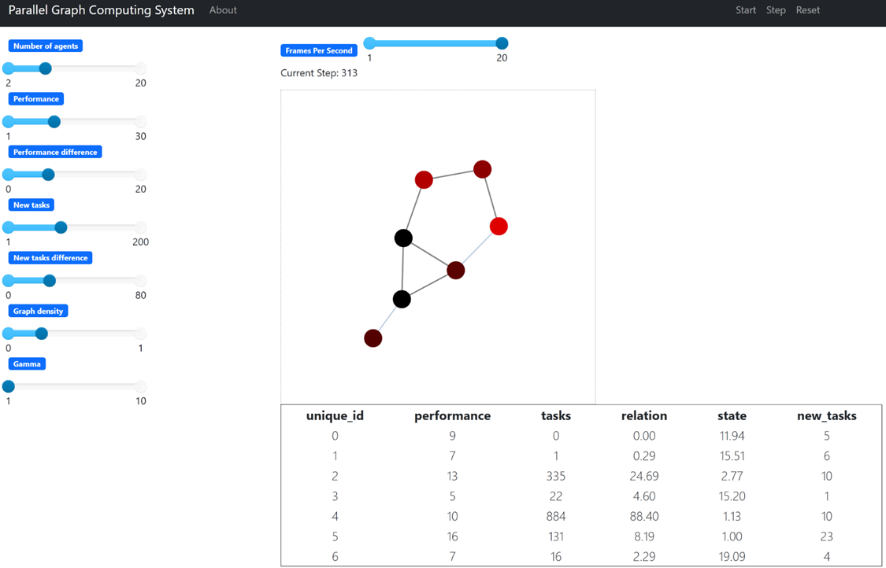

An example of the model running with visualization. Closed edges have a more transparent color. In the table, unique_id is the agent identifier. Tasks is the number of current tasks in the agent. Relation is the ratio of the number of tasks to the performance. State is the state of the agent. New tasks are the tasks received at this step.

Пример работы модели с визуализацией. Закрытые рёбра имеют более прозрачный цвет. В таблице, unique_id – идентификатор агента. Tasks – количество текущих задач, находящихся в агенте. Relation – отношение количества задач к производительности. State – состояние агента. New tasks – поступившие задачи на данном шаге.

Description
-
### EN
This project contains a solution to the problem of load balancing of nodes of a decentralized network using the Mesa and Networkx libraries in python. Jupyter Notebook was also used for data analysis.

At each step, each agent receives atomic tasks. Each agent has a performance - how many tasks it can perform per step. The topology of the connected graph defines the task transfer relationship, which is also dynamic, where the disappearance of any edge at a step occurs based on a probabilistic distribution.

The task is to achieve emergent intelligence and equal task distribution using some algorithm.

### RU
Этот проект содержит решение задачи балансировки загрузки узлов децентрализованной сети с помощью библиотек Меса и Networkx на python. Также был использован Jupyter Notebook для анализа данных.

На каждом шаге каждый агент получает атомарные задачи. У каждого агента есть производительность - то, сколько задач он может выполнить за шаг. Топология связного графа задаёт отношение передачи задач, которая при этом ещё и динамическая, где исчезновение любго ребра на шаге происходит исходя из вероятностного распределения.

Задача - при помощи некоторого алгоритма добиться эмерджентного интеллекта и равного распределения задач.